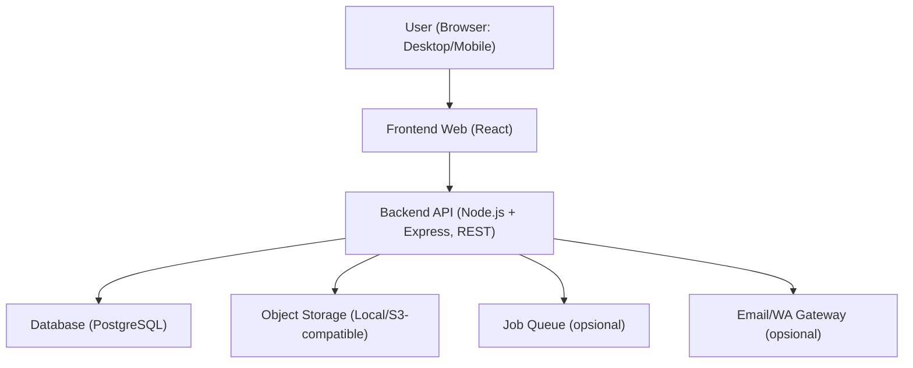
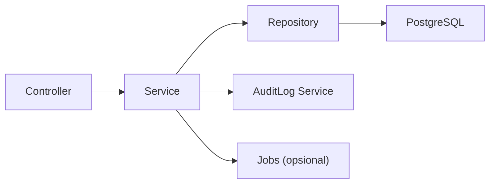
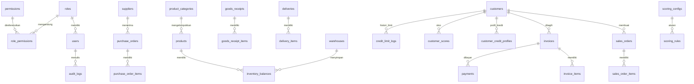

## 1. Desain Arsitektur



Prinsip:
- Modular per domain (sales, purchasing, inventory, finance/AR, master, reporting)
- Single source of truth: 1 database terpusat
- RESTful API + RBAC ketat di sisi backend

## 2. Teknologi
- Backend: Node.js (TypeScript) + Express, arsitektur Controller → Service → Repository
- Database: PostgreSQL
- Frontend: React + Vite, data fetching via REST
- Auth: JWT (access token + refresh token) berbasis HttpOnly cookie (default), atau Authorization header (opsional)
- RBAC: role + permission granular (per resource + action)
- File upload: bukti transfer disimpan ke object storage (default local filesystem; bisa diganti S3-compatible)
- Export: PDF & Excel di-generate dari backend (implementasi final mengikuti library yang disepakati saat coding)

## 3. Definisi Route (Frontend)
| Route | Tujuan |
|---|---|
| /login | Autentikasi |
| /dashboard | Ringkasan KPI + notifikasi |
| /users | Manajemen user |
| /roles | Manajemen role/permission |
| /audit-logs | Audit log |
| /master/suppliers | Supplier |
| /master/customers | Pelanggan + limit |
| /master/products | Produk + multi harga |
| /inventory/stock-cards | Kartu stok |
| /inventory/adjustments | Stock adjustment |
| /purchasing/pos | Purchase order |
| /purchasing/receipts | Penerimaan (GRN) |
| /sales/orders | Sales order |
| /sales/approvals | Approval SO/override |
| /sales/deliveries | Pengiriman / surat jalan |
| /sales/invoices | Invoice |
| /ar/payments | Input pembayaran |
| /ar/receivables | Daftar piutang + aging |
| /credit/store-analysis/:customerId | Analisa toko + scoring |
| /reports | Laporan + export |
| /settings | Konfigurasi (bobot scoring, aturan approval, dsb) |

## 4. Definisi API (RESTful)

Konvensi umum:
- Base URL: /api/v1
- Format respons sukses:
  - { data, meta? }
- Format error:
  - { error: { code, message, details? } }
- Pagination:
  - query: page, pageSize, sort, q, filters[...]
- Audit trail untuk operasi kritikal: limit, approval, pembayaran, stock adjustment

### 4.1 Auth
| Method | Endpoint | Deskripsi |
|---|---|---|
| POST | /auth/login | Login, return token/cookie |
| POST | /auth/logout | Logout/revoke refresh |
| POST | /auth/refresh | Refresh access token |
| POST | /auth/forgot-password | Kirim token reset |
| POST | /auth/reset-password | Reset password |
| GET | /auth/me | Profil user + permissions |

### 4.2 User, Role, Permission
| Method | Endpoint |
|---|---|
| GET/POST | /users |
| GET/PATCH/DELETE | /users/:id |
| GET/POST | /roles |
| GET/PATCH/DELETE | /roles/:id |
| GET | /permissions |
| GET | /audit-logs |

### 4.3 Master Data
| Resource | Endpoint |
|---|---|
| Supplier | /suppliers |
| Customer | /customers |
| Customer credit profile | /customers/:id/credit-profile |
| Product | /products |
| Product pricing rules | /pricing-rules |
| Warehouse | /warehouses |

### 4.4 Inventory
| Resource | Endpoint |
|---|---|
| Stock summary | /inventory/summary |
| Stock card | /inventory/stock-cards |
| Inventory transactions | /inventory/transactions |
| Stock adjustment | /inventory/adjustments |
| Warehouse transfer | /inventory/transfers |
| Minimum stock alerts | /inventory/alerts/min-stock |

### 4.5 Purchasing
| Resource | Endpoint |
|---|---|
| Purchase order | /purchase-orders |
| Goods receipt (GRN) | /goods-receipts |
| Purchase return | /purchase-returns |
| PO recommendations | /purchase-recommendations |

### 4.6 Sales
| Resource | Endpoint |
|---|---|
| Sales order | /sales-orders |
| SO approval | /sales-orders/:id/approve |
| Deliveries | /deliveries |
| Invoice | /invoices |
| Sales return | /sales-returns |
| Credit validation | /credit/validate |

### 4.7 Payment & Accounts Receivable (AR)
| Resource | Endpoint |
|---|---|
| Record payment | /payments |
| Payment upload proof | /payments/:id/proof |
| Payments by invoice | /invoices/:id/payments |
| Receivables list | /receivables |
| Aging report | /receivables/aging |
| Customer AR summary | /customers/:id/receivables-summary |

### 4.8 Credit Limit & Store Scoring
| Resource | Endpoint |
|---|---|
| Scoring config | /scoring/config |
| Recalculate score | /scoring/recalculate |
| Customer score history | /customers/:id/score-history |
| Credit limit change log | /customers/:id/credit-limit-logs |
| Store analysis | /customers/:id/store-analysis |

### 4.9 Reporting
| Method | Endpoint | Output |
|---|---|---|
| GET | /reports/sales | JSON |
| GET | /reports/purchases | JSON |
| GET | /reports/inventory | JSON |
| GET | /reports/ar | JSON |
| GET | /reports/profit-loss | JSON |
| GET | /exports/:type | PDF/Excel stream |

## 5. Diagram Arsitektur Server



## 6. Model Data

### 6.1 ERD (Mermaid)



### 6.2 Definisi Entitas Kunci (ringkas)
- customers
  - category: RETAIL/GROSIR/VIP
  - status: ACTIVE/BLOCKED
- customer_credit_profiles
  - credit_limit
  - payment_term_days (default jatuh tempo)
  - max_overdue_days_before_block (opsional)
- invoices
  - total_amount, due_date, status: UNPAID/PAID/OVERDUE
- payments
  - method: CASH/TRANSFER/TERM
  - amount, paid_at, proof_file_id (nullable)
  - satu invoice bisa banyak payment (cicilan)
- customer_scores
  - score (0-100), grade (A/B/C/D), calculated_at
- scoring_configs & scoring_rules
  - bobot dan rumus dapat diubah admin (mis. purchase_volume_weight, late_payment_weight, dsb)

### 6.3 DDL (Draft Minimal)

Catatan: ini draft untuk konsistensi desain; implementasi final akan dibuat saat coding (migrasi).

```sql
create table roles (
  id uuid primary key,
  name text not null unique,
  created_at timestamptz not null default now()
);

create table users (
  id uuid primary key,
  role_id uuid not null references roles(id),
  email text not null unique,
  password_hash text not null,
  full_name text not null,
  is_active boolean not null default true,
  created_at timestamptz not null default now(),
  updated_at timestamptz not null default now()
);

create table customers (
  id uuid primary key,
  code text not null unique,
  name text not null,
  category text not null,
  phone text,
  address text,
  status text not null default 'ACTIVE',
  created_at timestamptz not null default now(),
  updated_at timestamptz not null default now()
);

create table customer_credit_profiles (
  customer_id uuid primary key references customers(id) on delete cascade,
  credit_limit numeric(14,2) not null default 0,
  payment_term_days int not null default 0,
  max_overdue_days_before_block int,
  created_at timestamptz not null default now(),
  updated_at timestamptz not null default now()
);

create table invoices (
  id uuid primary key,
  customer_id uuid not null references customers(id),
  invoice_no text not null unique,
  invoice_date date not null,
  due_date date not null,
  total_amount numeric(14,2) not null,
  status text not null default 'UNPAID',
  created_at timestamptz not null default now(),
  updated_at timestamptz not null default now()
);

create table payments (
  id uuid primary key,
  invoice_id uuid not null references invoices(id) on delete cascade,
  method text not null,
  amount numeric(14,2) not null,
  paid_at timestamptz not null,
  note text,
  proof_file_id uuid,
  created_by uuid not null references users(id),
  created_at timestamptz not null default now()
);

create index payments_invoice_id_idx on payments(invoice_id);
create index invoices_customer_id_idx on invoices(customer_id);
create index invoices_due_date_idx on invoices(due_date);
```

## 7. Keamanan
- Password: hash kuat (bcrypt/argon2), tidak pernah disimpan plain
- Input validation: DTO validation di backend, sanitasi output untuk mencegah XSS
- SQL injection: ORM/query builder terparameterisasi, tanpa string concat query
- Auth: refresh token storage aman (HttpOnly cookie), rotasi refresh token (disarankan)
- RBAC: enforcement di backend (guard/middleware) per endpoint
- Audit: log perubahan kritikal + jejak approval
- Rate limit: login + endpoint sensitif

## 8. Otomasi & Notifikasi (MVP → bertahap)
- Job terjadwal:
  - hitung status overdue (harian)
  - hitung skor toko (harian/mingguan) atau event-driven setelah pembayaran
  - rekomendasi PO berdasarkan min stock
- Notifikasi:
  - in-app notification (MVP)
  - email reminder jatuh tempo (opsional)
  - WhatsApp gateway disiapkan sebagai adapter (opsional)
