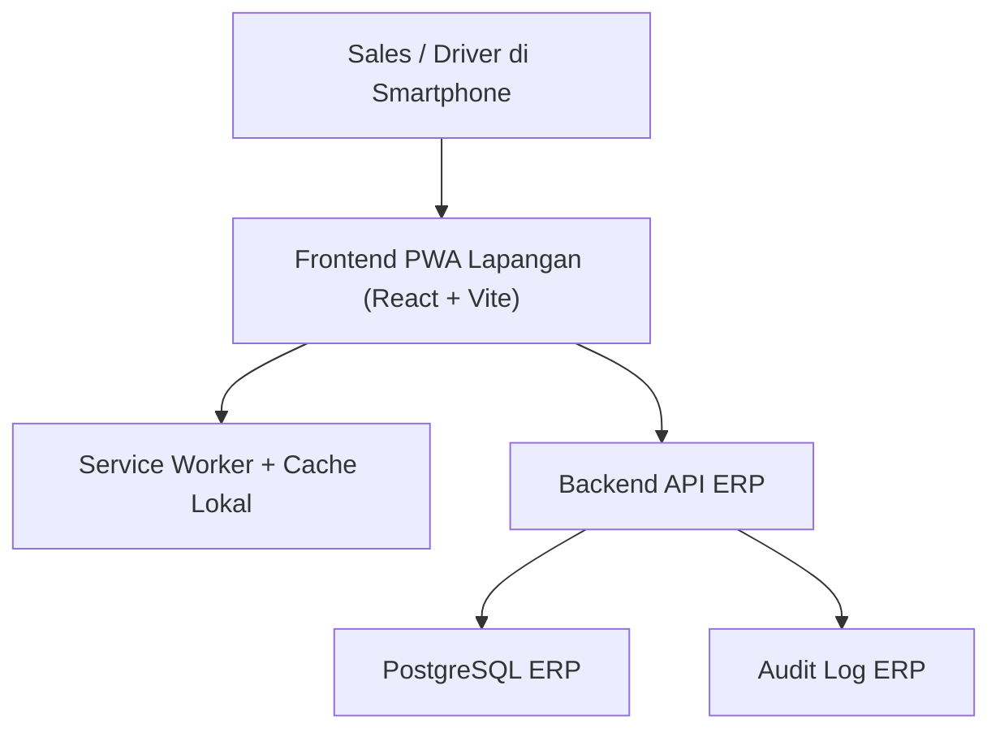
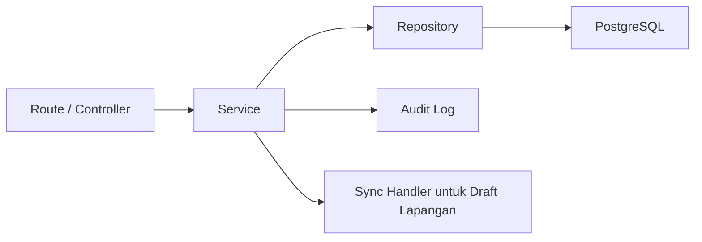
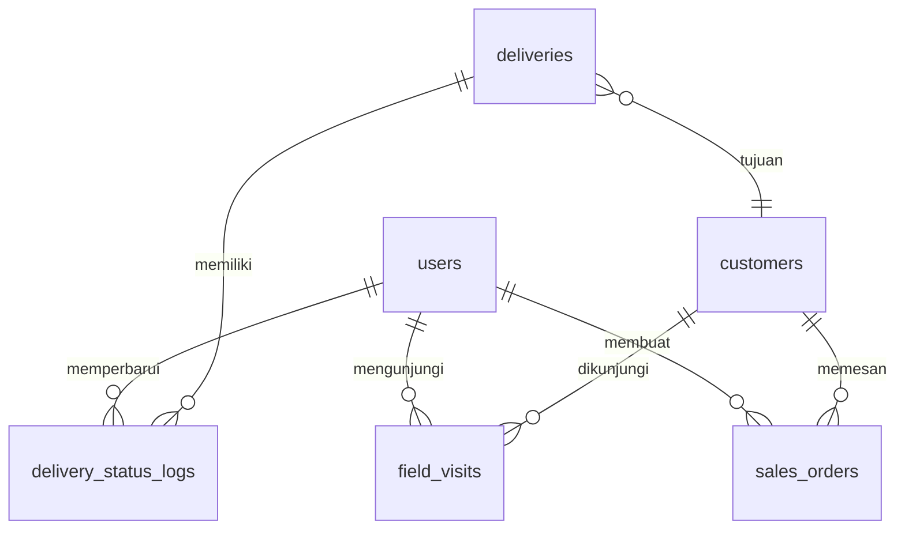

## 1. Desain Arsitektur



Prinsip:
- Frontend lapangan adalah antarmuka terpisah secara pengalaman pengguna, tetapi tetap memakai backend ERP yang sama.
- Gunakan pendekatan PWA mobile-first agar deployment tetap sederhana dan mudah diakses.
- Offline ringan hanya untuk cache data terakhir dan draft lokal, bukan transaksi penuh offline-first.
- Semua validasi final bisnis tetap diputuskan oleh backend ERP.

## 2. Deskripsi Teknologi
- Frontend: React 18 + Vite + TypeScript
- UI: Tailwind CSS + komponen mobile-first
- Routing: React Router
- Data fetching: REST API via client yang sudah ada atau client baru khusus app lapangan
- State lokal: React state + cache draft lokal
- Offline ringan: Service Worker + IndexedDB atau local storage terstruktur untuk draft ringan
- Auth: mengikuti backend ERP yang ada, dengan cookie/session atau token sesuai implementasi saat ini
- Deploy: satu frontend baru atau sub-app terpisah dalam repo yang sama, dipublish sebagai PWA

## 3. Definisi Route
| Route | Tujuan |
|---|---|
| /field/login | Login pengguna lapangan |
| /field/home | Beranda PWA Sales/Driver |
| /field/customers | Daftar pelanggan untuk kunjungan dan order |
| /field/customers/:id | Detail pelanggan, limit, tagihan, quick action |
| /field/sales-orders/new | Form buat Sales Order |
| /field/deliveries | Daftar pengiriman aktif |
| /field/deliveries/:id | Detail pengiriman dan update status |
| /field/visits | Daftar / input kunjungan toko |
| /field/receivables/:customerId | Ringkasan tagihan pelanggan |
| /field/sync | Status sinkronisasi draft lokal |

## 4. Definisi API

Konvensi:
- Base URL: mengikuti `/api/v1`
- Respons sukses: `{ data, meta? }`
- Respons gagal: `{ error: { code, message, details? } }`
- Semua endpoint lapangan wajib hemat payload dan mobile-friendly

### 4.1 Auth & Sesi
```ts
type FieldAuthResponse = {
  data: {
    user: {
      id: string;
      fullName: string;
      role: "Sales" | "Driver";
      permissions: string[];
    };
    sessionMode: "cookie" | "token";
  };
};
```

Endpoint utama:
- `POST /api/v1/auth/login`
- `POST /api/v1/auth/logout`
- `GET /api/v1/auth/me`

### 4.2 Beranda Lapangan
- `GET /api/v1/field/dashboard`

```ts
type FieldDashboardResponse = {
  data: {
    quickStats: {
      pendingOrders: number;
      activeDeliveries: number;
      visitsToday: number;
      pendingSyncItems: number;
    };
    todayTasks: Array<{
      id: string;
      type: "DELIVERY" | "VISIT" | "FOLLOW_UP";
      title: string;
      status: string;
      customerName?: string;
    }>;
  };
};
```

### 4.3 Pelanggan & Tagihan
- `GET /api/v1/customers?page=&pageSize=&q=`
- `GET /api/v1/customers/:id`
- `GET /api/v1/customers/:id/receivables-summary`
- `GET /api/v1/customers/:id/credit-profile`

```ts
type CustomerReceivableSummary = {
  data: {
    customerId: string;
    customerName: string;
    creditLimit: number;
    outstandingActive: number;
    availableLimit: number;
    overdueInvoiceCount: number;
    openInvoices: Array<{
      id: string;
      invoiceNo: string;
      dueDate: string;
      remainingAmount: number;
      status: "UNPAID" | "PAID" | "OVERDUE";
    }>;
  };
};
```

### 4.4 Buat Sales Order
- `POST /api/v1/sales-orders`
- `POST /api/v1/credit/validate`
- `GET /api/v1/products?page=&pageSize=&q=`

```ts
type FieldSalesOrderDraft = {
  localId: string;
  customerId: string;
  notes?: string;
  items: Array<{
    productId: string;
    qty: number;
    unitPrice?: number;
    discountAmount?: number;
  }>;
  createdAt: string;
  syncStatus: "LOCAL_DRAFT" | "PENDING_SYNC" | "SYNCED" | "FAILED";
};

type CreateSalesOrderResponse = {
  data: {
    salesOrderId: string;
    orderNo: string;
    status: string;
    approvalContext?: {
      requestSummary: string;
      requestLines: string[];
    };
  };
};
```

### 4.5 Pengiriman Driver
- `GET /api/v1/deliveries?assignedToMe=true`
- `GET /api/v1/deliveries/:id`
- `POST /api/v1/deliveries/:id/status`

```ts
type DeliveryStatusUpdateRequest = {
  status: "ON_THE_WAY" | "DELIVERED" | "FAILED";
  note?: string;
  updatedAtClient: string;
};
```

### 4.6 Kunjungan Toko
- `GET /api/v1/field/visits?date=`
- `POST /api/v1/field/visits`

```ts
type FieldVisitRequest = {
  customerId: string;
  visitStatus: "OPEN" | "CLOSED" | "NOT_FOUND" | "FOLLOW_UP";
  note?: string;
  visitedAt: string;
  source: "ONLINE" | "OFFLINE_SYNC";
};
```

### 4.7 Sinkronisasi Draft
- `POST /api/v1/field/sync/sales-orders`
- `POST /api/v1/field/sync/visits`
- `POST /api/v1/field/sync/delivery-updates`

```ts
type SyncBatchResponse = {
  data: {
    accepted: number;
    failed: number;
    failures: Array<{
      localId: string;
      reason: string;
    }>;
  };
};
```

## 5. Diagram Arsitektur Server



## 6. Model Data

### 6.1 Definisi Model Data



### 6.2 Definisi Entitas
- `field_visits`
  - menyimpan kunjungan toko dari sales/driver
  - status visit, catatan, waktu kunjungan, dan sumber sinkronisasi
- `delivery_status_logs`
  - histori perubahan status pengiriman dari frontend lapangan
- `local draft`
  - tidak wajib menjadi tabel database baru bila hanya disimpan di client
  - backend cukup menerima payload sinkronisasi batch

### 6.3 DDL Draft Tambahan
Jika modul kunjungan belum ada di backend, tambahan tabel minimal yang disarankan:

```sql
create table field_visits (
  id uuid primary key,
  customer_id uuid not null references customers(id),
  visited_by uuid not null references users(id),
  visit_status text not null,
  note text,
  visited_at timestamptz not null,
  source text not null default 'ONLINE',
  created_at timestamptz not null default now()
);

create table delivery_status_logs (
  id uuid primary key,
  delivery_id uuid not null references deliveries(id) on delete cascade,
  updated_by uuid not null references users(id),
  status text not null,
  note text,
  updated_at timestamptz not null,
  created_at timestamptz not null default now()
);

create index idx_field_visits_customer_id on field_visits(customer_id);
create index idx_field_visits_visited_by on field_visits(visited_by);
create index idx_delivery_status_logs_delivery_id on delivery_status_logs(delivery_id);
```
