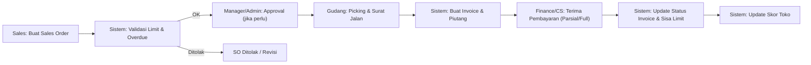
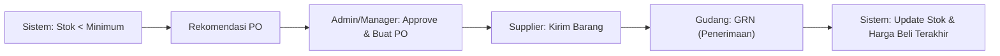

## 1. Gambaran Produk
Aplikasi ERP berbasis web untuk perusahaan distributor makanan & minuman yang mengelola proses end-to-end: pembelian → stok → penjualan → pembayaran/piutang → pelaporan, dalam 1 sistem terpusat multi-user.
- Target user: Admin, Manager, Sales, Gudang (opsional: Finance/Owner jika dibutuhkan nanti)
- Nilai utama: alur kerja jelas, data konsisten lintas modul, kontrol kredit/piutang, visibilitas bisnis real-time

## 2. Fitur Inti

### 2.1 Peran Pengguna (RBAC)
| Role | Cara Akses | Hak Akses Inti |
|------|------------|----------------|
| Admin | Login internal | Kelola user/role, master data, konfigurasi, override/approval, audit log |
| Manager | Login internal | Approval berjenjang, monitoring KPI, laporan, pengaturan limit & scoring |
| Sales | Login internal (desktop/mobile web) | Buat sales order, input pelanggan, lihat stok ringkas & status piutang, kunjungan/target (opsional) |
| Gudang | Login internal | Penerimaan barang, picking/packing, surat jalan, mutasi gudang, penyesuaian stok |

### 2.2 Modul & Halaman Utama
1. **Autentikasi & User**: login, logout, reset password, manajemen user/role, audit log
2. **Master Data**: supplier, pelanggan (toko), produk, kategori, satuan, gudang (opsional multi), pengaturan harga per kategori pelanggan
3. **Inventory**: kartu stok, transaksi masuk/keluar, mutasi antar gudang, stock adjustment, minimum stock alert, FIFO & batch/expired (opsional)
4. **Purchasing**: PO, penerimaan barang (GRN), retur pembelian
5. **Sales**: sales order, approval, pengiriman (surat jalan), invoice, retur penjualan, multi harga & diskon (per item/per transaksi)
6. **Pembayaran & Piutang (AR)**: pembayaran invoice (cash/transfer/tempo), cicilan, upload bukti transfer, aging piutang, notifikasi jatuh tempo, blok/approval kredit
7. **Credit Limit & Store Scoring**: konfigurasi bobot, skor/grade otomatis, histori perubahan limit, halaman analisa toko
8. **Dashboard & Reporting**: ringkasan penjualan, stok kritis, top produk, laporan penjualan/pembelian/stok/piutang, laba rugi sederhana, ekspor PDF/Excel
9. **Notifikasi & Otomasi**: alert stok menipis, reminder jatuh tempo, rekomendasi PO, peringatan invoice overdue, (opsional) auto-block pelanggan berisiko
10. **Pencarian Global**: pencarian cepat invoice, order, pelanggan, produk, PO

### 2.3 Detail Halaman (MVP)
| Nama Halaman | Modul | Deskripsi Fitur |
|---|---|---|
| Login | Auth | Login, lupa password, refresh token (sesuai arsitektur) |
| Manajemen User & Role | User | CRUD user, assign role/permission, reset password, disable user |
| Audit Log | User | Riwayat aktivitas & perubahan penting (limit kredit, approval, pembayaran) |
| Supplier | Master | CRUD supplier, riwayat PO & pembayaran supplier (fase lanjut) |
| Pelanggan (Toko) | Master | CRUD customer, kategori, limit kredit, jatuh tempo default, status blokir, histori pembayaran ringkas |
| Produk | Master | CRUD produk, SKU, satuan, kategori, harga beli, harga jual default, multi harga per kategori pelanggan |
| Gudang | Master/Inventory | CRUD gudang (opsional multi), stok ringkas per gudang |
| Kartu Stok | Inventory | Riwayat pergerakan stok per produk, filter gudang, tipe transaksi |
| Stock Adjustment | Inventory | Penyesuaian stok dengan alasan, butuh approval (opsional) |
| Purchase Order | Purchasing | Buat PO, status, approval (opsional), cetak PO (opsional) |
| Penerimaan Barang (GRN) | Purchasing/Inventory | Terima barang dari PO, update stok otomatis, catat selisih |
| Retur Pembelian | Purchasing | Retur ke supplier, update stok |
| Sales Order | Sales | Buat SO, diskon, multi harga, validasi limit kredit, status order |
| Approval Order | Sales | Approval berjenjang: Sales → Manager → Admin (configurable) |
| Pengiriman / Surat Jalan | Sales/Inventory | Picking/packing, alokasi stok, status kirim, cetak surat jalan |
| Invoice | Sales/Finance | Generate invoice dari pengiriman, status pembayaran, jatuh tempo |
| Retur Penjualan | Sales/Inventory | Retur dari pelanggan, update stok, nota retur |
| Pembayaran Invoice | Payment/AR | Metode cash/transfer/tempo, pembayaran parsial, upload bukti transfer, rekonsiliasi sederhana |
| Daftar Piutang & Aging | AR | Filter by customer, bucket aging (0–30,31–60,61–90,>90), status overdue |
| Analisa Toko | Credit/Scoring | Profil, limit & sisa limit, grafik pembelian/pembayaran, skor & grade, rekomendasi limit |
| Dashboard | Dashboard | KPI ringkas: penjualan, piutang overdue, stok kritis, top produk, trend |
| Reporting | Reporting | Laporan penjualan/pembelian/stok/piutang, laba rugi sederhana, export PDF/Excel |

## 3. Proses Inti (Alur Bisnis)

### 3.1 Penjualan Tempo (End-to-End)
1. Sales membuat Sales Order (SO)
2. Sistem cek:
   - limit kredit (sisa limit) + total piutang aktif
   - ada invoice overdue (opsional: blok otomatis)
3. Jika melanggar:
   - ditolak otomatis, atau
   - masuk antrean approval override (Manager/Admin)
4. Gudang menyiapkan pengiriman (surat jalan) dan stok berkurang
5. Invoice dibuat dari pengiriman (piutang bertambah)
6. Pembayaran masuk (cash/transfer/cicilan)
7. Status invoice berubah: Belum Lunas → Lunas / Overdue
8. Sisa limit & skor toko diperbarui

### 3.2 Restock (Pembelian)
1. Sistem memonitor minimum stok
2. Buat rekomendasi PO (otomatis) atau manual oleh Admin/Manager
3. PO dikirim ke supplier
4. Barang datang → GRN → stok bertambah
5. Jika ada retur pembelian → stok berkurang dan tercatat

### 3.3 Pembayaran & Piutang
- Metode: Cash, Transfer (upload bukti), Tempo (wajib jatuh tempo, opsional termin)
- Mendukung cicilan: beberapa pembayaran untuk 1 invoice
- Status invoice: Belum Lunas, Lunas, Overdue (melewati jatuh tempo)
- Notifikasi jatuh tempo & overdue

## 4. Desain UI/UX

### 4.1 Gaya Desain
- Tema: clean, profesional, fokus data-dense (tabel), kontras jelas, micro-interaction ringan
- Navigasi: sidebar kiri + topbar (search, profile, notifikasi)
- Komponen tabel: filter, sort, pagination, kolom dapat diatur (opsional)
- Form: validasi real-time, input cepat (auto-complete produk/pelanggan), keyboard-friendly

### 4.2 Ringkasan Desain per Halaman (contoh elemen)
| Halaman | Elemen UI Kunci |
|---|---|
| Dashboard | kartu KPI, grafik trend, daftar stok kritis, daftar invoice overdue |
| Sales Order | form wizard/sectioned, pencarian produk, ringkasan limit & status toko, tombol submit + status |
| Invoice & Pembayaran | timeline pembayaran, upload bukti, badge status, tabel aging piutang |
| Analisa Toko | profil + kartu limit, grafik pembelian/pembayaran, skor & grade, rekomendasi |

### 4.3 Responsif
- Desktop-first untuk operasi kantor/gudang
- Mobile-adaptive untuk Sales lapangan (web mobile): list ringkas, quick actions, input order cepat

## 5. Non-Fungsional (Kualitas)
- Skalabilitas: API terpisah dari UI, desain modular per domain
- Keamanan: password terenkripsi, validasi input, proteksi XSS/CSRF sesuai metode auth, rate limiting login
- Auditability: semua perubahan kritikal (limit, approval, pembayaran, adjustment) tercatat
- Kinerja: pagination server-side untuk tabel besar, caching ringan untuk master data (opsional)

## 6. Aturan Bisnis Kunci (MVP)
- Validasi kredit saat SO dibuat dan saat invoice diterbitkan (konfigurasi)
- Approval berjenjang configurable per skenario (override limit, stock adjustment, diskon besar)
- Perhitungan skor toko berbasis bobot yang dapat diubah Admin
- FIFO & batch/expired diaktifkan per produk (opsional) agar tidak membebani semua SKU
