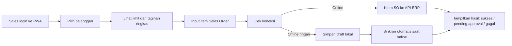
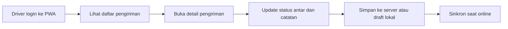
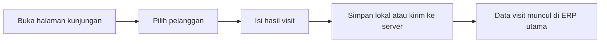

## 1. Gambaran Produk
Frontend lapangan berbasis PWA mobile untuk Sales dan Driver yang dipakai saat kunjungan pelanggan, input Sales Order, melihat tagihan, dan mengelola pengiriman dengan antarmuka yang cepat, sederhana, dan ramah kondisi sinyal tidak stabil.
- Tujuan utama: mempercepat operasional lapangan tanpa harus membuka ERP desktop penuh, sekaligus menjaga data tetap sinkron dengan ERP utama.
- Nilai bisnis: Sales lebih cepat membuat order di toko, Driver lebih mudah menjalankan pengiriman, dan manajemen mendapat data kunjungan serta status operasional lapangan secara real-time.

## 2. Fitur Inti

### 2.1 Peran Pengguna
| Peran | Cara Akses | Hak Akses Inti |
|------|------------|----------------|
| Sales | Login internal PWA | Cari pelanggan, lihat ringkasan limit/tagihan, buat draft/SO, check-in kunjungan, lihat histori kunjungan |
| Driver | Login internal PWA | Lihat daftar pengiriman, buka detail pengiriman, update status antar, catat hasil kunjungan lapangan sederhana |
| Admin/Manager | Login internal ERP utama | Monitoring hasil dari frontend lapangan, bukan pengguna utama aplikasi ini |

### 2.2 Modul Fitur
1. **Login Lapangan**: autentikasi sederhana, sesi aman, deteksi role Sales/Driver, penyimpanan sesi mobile-friendly.
2. **Beranda Lapangan**: ringkasan tugas hari ini, quick action, daftar pelanggan/tujuan, status sinkronisasi offline.
3. **Buat Sales Order**: pilih pelanggan, lihat limit & tagihan ringkas, cari produk, simpan draft offline ringan, kirim order saat online.
4. **Antar Barang**: daftar surat jalan/pengiriman, detail item kirim, status perjalanan, update selesai/gagal antar.
5. **Kunjungan Toko**: check-in kunjungan, catatan hasil visit, status toko buka/tutup, tindak lanjut.
6. **Tagihan Pelanggan**: ringkasan limit kredit, outstanding aktif, invoice belum lunas, status overdue.
7. **Sinkronisasi Ringan**: cache data penting terakhir, tandai draft lokal, kirim ulang saat koneksi pulih.

### 2.3 Detail Halaman
| Nama Halaman | Modul | Deskripsi Fitur |
|---|---|---|
| Login | Auth | Login dengan email/password, validasi role Sales/Driver, persist sesi untuk mobile |
| Beranda | Dashboard Lapangan | Quick action `Buat SO`, `Antar Hari Ini`, `Kunjungan`, `Tagihan`; info sinkronisasi dan tugas aktif |
| Daftar Pelanggan | Sales | Cari pelanggan, filter wilayah/rute, buka detail pelanggan |
| Detail Pelanggan | Sales | Profil toko, limit kredit, outstanding, invoice aktif, histori order singkat |
| Buat Sales Order | Sales | Pilih pelanggan, cari produk cepat, tambah item, lihat ringkasan limit, simpan draft offline ringan, kirim order |
| Daftar Pengiriman | Driver | List pengiriman aktif, filter status, urut per rute/hari |
| Detail Pengiriman | Driver | Lihat item kirim, info pelanggan, update status `menuju`, `selesai`, `gagal`, tambah catatan |
| Kunjungan Toko | Sales/Driver | Check-in visit, status kunjungan, catatan lapangan, hasil follow-up |
| Tagihan Pelanggan | Sales | Daftar invoice aktif, overdue, total outstanding, limit tersisa |
| Sinkronisasi | Sistem | Indikator online/offline, daftar draft pending, retry sinkron manual |

## 3. Proses Inti

### 3.1 Sales Membuat Order Saat Kunjungan
1. Sales login ke PWA.
2. Sales memilih pelanggan yang sedang dikunjungi.
3. Sistem menampilkan ringkasan limit kredit, invoice aktif, dan status overdue dari data terakhir.
4. Sales mencari produk dan mengisi item order.
5. Jika koneksi bagus, order langsung dikirim ke ERP.
6. Jika koneksi jelek/offline ringan, order disimpan sebagai draft lokal lalu dikirim saat online.
7. Sistem menampilkan hasil: berhasil, pending approval, atau gagal validasi.

### 3.2 Driver Menjalankan Pengiriman
1. Driver login ke PWA.
2. Driver melihat daftar pengiriman aktif untuk hari itu.
3. Driver membuka detail pengiriman dan melihat item serta alamat tujuan.
4. Driver memperbarui status saat perjalanan dan saat selesai antar.
5. Jika koneksi terputus, status perubahan disimpan sementara lalu disinkronkan saat online.

### 3.3 Kunjungan Toko
1. Sales atau Driver membuka halaman kunjungan.
2. Pilih pelanggan/tujuan yang sedang dikunjungi.
3. Input hasil visit: toko buka/tutup, catatan, tindak lanjut.
4. Data kunjungan tersimpan dan dapat dipantau dari ERP utama.

## 4. Desain Antarmuka

### 4.1 Gaya Desain
- Gaya utama: utilitarian mobile, fokus kecepatan, tombol besar, teks jelas, kontras tinggi, satu tangan friendly.
- Warna: basis netral terang, aksen hijau untuk aksi sukses, oranye untuk status proses, merah untuk perhatian limit/tagihan.
- Tombol: rounded medium-large, area tap besar, sticky action bar di bagian bawah untuk aksi utama.
- Tipografi: headline tegas dan ringkas, body font mudah dibaca di layar kecil, hierarki visual kuat.
- Layout: mobile-first dengan kartu tugas, daftar ringkas, tab bawah atau quick action grid.
- Ikon: sederhana, operasional, mudah dibaca cepat di lapangan.

### 4.2 Ringkasan Desain per Halaman
| Nama Halaman | Modul | Elemen UI |
|---|---|---|
| Beranda | Dashboard Lapangan | kartu tugas hari ini, indikator offline, quick action besar, daftar prioritas |
| Detail Pelanggan | Sales | kartu limit, ringkasan tagihan, badge overdue, tombol `Buat SO` |
| Buat SO | Sales | pencarian produk cepat, item card, summary sticky bawah, status sinkron |
| Daftar Pengiriman | Driver | kartu tujuan, status pengiriman, tombol buka detail, filter hari/rute |
| Detail Pengiriman | Driver | daftar item, status step-by-step, catatan pengiriman, tombol update |
| Kunjungan Toko | Sales/Driver | form ringkas, pilihan status toko, catatan, tombol simpan cepat |

### 4.3 Responsivitas
- Pendekatan utama: mobile-first PWA.
- Target utama: layar smartphone Android.
- Tetap usable di tablet kecil dan desktop, tetapi desain dioptimalkan untuk penggunaan lapangan.
- Mendukung touch gesture dasar, sticky CTA, dan komponen hemat scroll.

## 5. Kualitas Non-Fungsional
- Performa: halaman inti harus cepat terbuka di jaringan seluler biasa.
- Offline ringan: cache data penting terakhir dan draft lokal untuk SO, kunjungan, dan update pengiriman sederhana.
- Keamanan: autentikasi tetap memakai sistem ERP, role-based access ketat, data sensitif tidak disimpan berlebihan di cache lokal.
- Audit: semua aksi penting seperti submit SO, update pengiriman, dan catatan visit tetap tercatat di backend saat sinkron.
- Reliabilitas: jika sinkron gagal, user mendapat status jelas dan tombol retry.

## 6. Aturan Bisnis Kunci
- Sales hanya bisa membuat order untuk pelanggan yang diizinkan oleh role dan cakupan wilayah/rute bila aturan ini tersedia.
- Ringkasan limit dan tagihan di frontend lapangan bersifat operasional cepat; keputusan final tetap mengikuti validasi backend ERP saat submit.
- Draft offline tidak dianggap order final sampai berhasil tersinkron ke server.
- Driver tidak bisa mengubah harga/order item; fokus driver hanya pada pengiriman dan catatan lapangan.
- Kunjungan toko harus bisa dicatat walau koneksi tidak stabil, lalu disinkron saat online.
